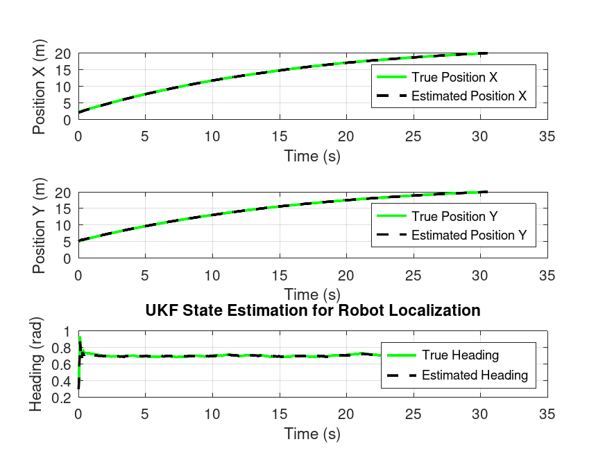
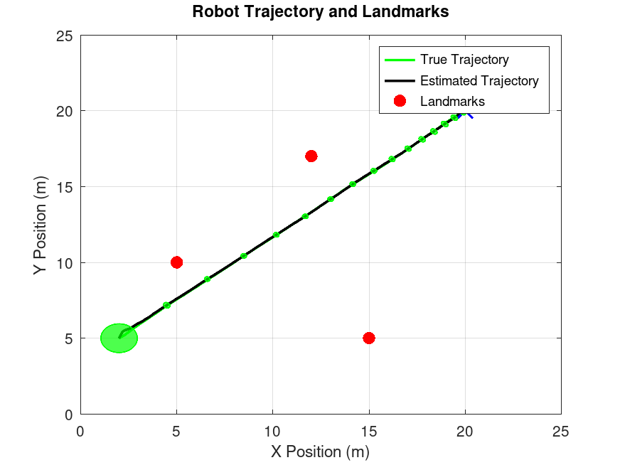

# Unscented Kalman Filter for Robot Localization and Control

This project implements an **Unscented Kalman Filter (UKF)** for robot localization using landmark-based measurements, combined with a **PID controller** for autonomous navigation to a target position.

## Table of Contents
- [Overview](#overview)
- [Video Demonstration](#video-demonstration)
- [Mathematical Background](#mathematical-background)
- [Project Structure](#project-structure)
- [Main Functions](#main-functions)
- [Helper Functions](#helper-functions)
- [Implementation Details](#implementation-details)
- [Results](#results)
- [Usage](#usage)
- [Parameters](#parameters)
- [Future Work](#future-work)

---

## Overview

The project demonstrates a complete autonomous navigation system where:
1. A robot moves in a 2D environment with known landmark positions
2. The robot measures distance and bearing to multiple landmarks (with noise)
3. An **Unscented Kalman Filter** estimates the robot's true position and heading
4. A **PID controller** generates velocity and steering commands to reach a target position
5. The system accounts for process and measurement noise in real-time

**State Vector:** `x = [x, y, θ]ᵀ`
- `x, y`: Robot position in 2D space (meters)
- `θ`: Robot heading angle (radians)

**Control Inputs:** `u = [v, δ]ᵀ`
- `v`: Forward velocity (m/s)
- `δ`: Steering angle (radians)

**Measurements:** `z = [r₁, φ₁, r₂, φ₂, ..., rₙ, φₙ]ᵀ`
- `rᵢ`: Distance to landmark i
- `φᵢ`: Bearing angle to landmark i

---

## Video Demonstration

The simulation generates an animation video showing:
- **Left panel**: Full trajectory view with all landmarks, target, and uncertainty ellipses
- **Right panel**: Zoomed view (1.2m × 1.2m) following the robot with realistic car visualization
- **Information overlay**: Real-time position, heading, and distance to target
- **Green filled car**: True robot state
- **Black outline car**: UKF estimated state

**Generated file:** `robot_sim.mp4`

> **Note:** Video generation can be time-consuming. If you see an error viewing the video on GitHub, regenerate it locally:
> ```octave
> pkg load statistics
> pkg load video
> UKF_Robot_Localization_and_Control
> ```
> Then commit and push the updated video file.

The video demonstrates:
- Smooth convergence of estimated state to true state
- Shrinking uncertainty ellipses as robot approaches landmarks
- Robust navigation with PID control
- Accurate state estimation throughout the trajectory

---

## Mathematical Background

### Unscented Kalman Filter (UKF)

The UKF is a nonlinear state estimation algorithm that uses the **Unscented Transform** to handle nonlinearity. Unlike the Extended Kalman Filter (EKF), which linearizes the system using Jacobians, the UKF propagates carefully selected **sigma points** through the nonlinear functions.

#### Key Concepts

**1. Sigma Points Generation**

For a state `x` with covariance `P`, we generate `2n+1` sigma points:

```
χ₀ = x
χᵢ = x + (√((n+λ)P))ᵢ,     i = 1, ..., n
χᵢ₊ₙ = x - (√((n+λ)P))ᵢ,   i = 1, ..., n
```

Where:
- `n` = dimension of state vector
- `λ = α²(n + κ) - n` = scaling parameter
- `α` = spread of sigma points (typically 0.00001 - 1)
- `κ` = secondary scaling parameter (typically 0)
- `β` = incorporates prior knowledge of distribution (2 is optimal for Gaussian)

**2. Weights for Mean and Covariance**

```
Wₘ⁽⁰⁾ = λ / (n + λ)
Wc⁽⁰⁾ = λ / (n + λ) + (1 - α² + β)
Wₘ⁽ⁱ⁾ = Wc⁽ⁱ⁾ = 1 / (2(n + λ)),  i = 1, ..., 2n
```

**3. Prediction Step**

Propagate each sigma point through the process model:

```
χᵢ⁻ = f(χᵢ, u)
```

Predicted state mean:
```
x̄⁻ = Σᵢ Wₘ⁽ⁱ⁾ χᵢ⁻
```

Predicted state covariance:
```
P⁻ = Σᵢ Wc⁽ⁱ⁾ (χᵢ⁻ - x̄⁻)(χᵢ⁻ - x̄⁻)ᵀ + Q
```

**4. Update Step**

Propagate predicted sigma points through measurement model:

```
Zᵢ = h(χᵢ⁻)
```

Predicted measurement mean:
```
z̄ = Σᵢ Wₘ⁽ⁱ⁾ Zᵢ
```

Innovation covariance:
```
S = Σᵢ Wc⁽ⁱ⁾ (Zᵢ - z̄)(Zᵢ - z̄)ᵀ + R
```

Cross-covariance:
```
Pₓz = Σᵢ Wc⁽ⁱ⁾ (χᵢ⁻ - x̄⁻)(Zᵢ - z̄)ᵀ
```

Kalman gain:
```
K = Pₓz S⁻¹
```

Updated state estimate:
```
x̂ = x̄⁻ + K(z - z̄)
```

Updated covariance:
```
P = P⁻ - KSKᵀ
```

### Robot Motion Model (Bicycle Model)

The robot follows a **bicycle kinematic model** with front-wheel steering:

**For steering angle δ ≠ 0:**
```
β = (v·dt / L) · tan(δ)
R = L / tan(δ)

ẋ = R · (sin(θ + β) - sin(θ))
ẏ = R · (-cos(θ + β) + cos(θ))
θ̇ = β / dt
```

**For straight motion (δ ≈ 0):**
```
ẋ = v·dt · cos(θ)
ẏ = v·dt · sin(θ)
θ̇ = 0
```

Where:
- `L` = wheelbase (distance between axles)
- `R` = turning radius
- `β` = change in heading angle

### Measurement Model

For each landmark at position `(lₓ, lᵧ)`:

```
Δx = lₓ - x
Δy = lᵧ - y

r = √(Δx² + Δy²)           (range/distance)
φ = atan2(Δy, Δx) - θ       (bearing angle)
```

### PID Controller

**Distance Controller (Velocity):**
```
e_dist(t) = ||target - position||
v(t) = Kₚ·e_dist + Kᵢ·∫e_dist dt + Kd·(de_dist/dt)
```

**Heading Controller (Steering):**
```
θ_desired = atan2(target_y - y, target_x - x)
e_heading(t) = θ_desired - θ
δ(t) = Kₚ·e_heading + Kᵢ·∫e_heading dt + Kd·(de_heading/dt)
```

---

## Project Structure

```
UKF/
├── UKF_Robot_Localization_and_Control.m  # Main script with UKF + PID control
├── UKF_Robot_Localization.m              # UKF localization only (no control)
├── create_animation.m                     # Video generation function
├── sigma_points.m                         # Sigma point generation
├── normalize_angle.m                      # Angle wrapping to [-π, π]
├── plot_covariance_ellipse.m             # Uncertainty visualization
├── draw_robot.m                           # Robot car visualization
├── robot_sim.mp4                          # Generated animation video
├── UKF_State_Estimation.png              # Results: state vs time plots
├── Robot_Trajectory_and_Landmarks.png    # Results: trajectory with ellipses
└── README.md                              # This file
```

---

## Main Functions

### UKF_Robot_Localization_and_Control.m

**Purpose:** Complete autonomous navigation system combining UKF state estimation with PID control.

**Main Loop Structure:**
1. **Control Generation:** PID controller computes velocity and steering based on previous state estimate
2. **True System Simulation:** Robot moves according to bicycle model with process noise
3. **Measurement Generation:** Compute noisy range and bearing to all landmarks
4. **UKF Prediction:** Propagate sigma points through motion model
5. **UKF Update:** Incorporate measurements to refine state estimate
6. **Visualization:** Generate video frames and final plots

**Key Features:**
- Real-time target tracking with PID control
- Multi-landmark fusion (3 landmarks)
- Covariance ellipse visualization
- Video animation generation with dual views
- Early termination when target is reached
- Process and measurement noise handling

**Control Loop:**
```octave
for k = 2:length(t)
    % 1. PID Controller (uses x_est(:,k-1))
    % 2. True system propagation
    % 3. Measurement generation
    % 4. UKF Prediction
    % 5. UKF Update
end
```

---

## Helper Functions

### 1. sigma_points.m

**Signature:** `[chi] = sigma_points(x, P, lambda, n)`

**Purpose:** Generates `2n+1` sigma points for the Unscented Transform.

**Inputs:**
- `x`: State vector (n×1)
- `P`: State covariance matrix (n×n)
- `lambda`: Scaling parameter
- `n`: State dimension

**Output:**
- `chi`: Sigma points matrix (n×(2n+1))

**Algorithm:**
```octave
S = chol((n + lambda) * P, 'lower')  % Matrix square root
chi(:,1) = x                          % Central point
chi(:,2:n+1) = x + S                  % Positive spread
chi(:,n+2:2n+1) = x - S               % Negative spread
```

**Mathematical Basis:** The Cholesky decomposition ensures that `SSᵀ = (n+λ)P`, satisfying the sigma point property.

---

### 2. normalize_angle.m

**Signature:** `angle = normalize_angle(angle)`

**Purpose:** Wraps angles to the range `[-π, π]` to handle discontinuities.

**Input:**
- `angle`: Angle in radians (any range)

**Output:**
- `angle`: Normalized angle in `[-π, π]`

**Algorithm:**
```octave
angle = mod(angle, 2*pi)      % Map to [0, 2π)
if angle > pi
    angle = angle - 2*pi      % Map to [-π, π]
end
```

**Why Necessary:** Angles exhibit wraparound behavior (e.g., 359° = -1°). Without normalization:
- Heading errors would be incorrect (e.g., error between 10° and 350° would be 340° instead of 20°)
- Covariance computations would be invalid
- Control decisions would be erroneous

---

### 3. plot_covariance_ellipse.m

**Signature:** `plot_covariance_ellipse(mu, Sigma, n_sigma, color)`

**Purpose:** Visualizes uncertainty as filled ellipses representing confidence regions.

**Inputs:**
- `mu`: 2D mean vector [x; y]
- `Sigma`: 2×2 covariance matrix
- `n_sigma`: Number of standard deviations (e.g., 3 for 99.7% confidence)
- `color`: Fill/edge color

**Algorithm:**
1. Eigenvalue decomposition: `Sigma = VDVᵀ`
2. Semi-axes lengths: `a = n_sigma√λ₁`, `b = n_sigma√λ₂`
3. Rotation angle: `θ = atan2(v₂₁, v₁₁)` (angle of major axis)
4. Generate ellipse in standard position
5. Rotate and translate to actual position
6. Fill with transparency (α = 0.7)

**Mathematical Basis:** For a Gaussian distribution, the `n-sigma` ellipse is defined by:
```
(x - μ)ᵀ Σ⁻¹ (x - μ) = n²
```

---

### 4. draw_robot.m

**Signature:** `draw_robot(x, y, theta, length, width, color, style)`

**Purpose:** Visualizes robot as a realistic car with heading direction.

**Inputs:**
- `x, y`: Robot position (meters)
- `theta`: Heading angle (radians)
- `length`: Car length (0.3m default)
- `width`: Car width (0.15m default)
- `color`: 'g' (green), 'k' (black), etc.
- `style`: 'filled' or 'outline'

**Features:**
- Rectangular car body rotated by heading angle
- Directional arrow showing forward direction
- Filled (true state) vs outline (estimated state)
- Automatically excluded from legends via `HandleVisibility='off'`

---

### 5. create_animation.m

**Signature:** `create_animation(x_store, x_est, P_store, t, landmarks, target_position, num_landmarks)`

**Purpose:** Generates MP4 video animation of the entire simulation.

**Inputs:**
- `x_store`: True state trajectory (3×N)
- `x_est`: Estimated state trajectory (3×N)
- `P_store`: Covariance history (3×3×N)
- `t`: Time vector
- `landmarks`: Landmark positions
- `target_position`: Target location
- `num_landmarks`: Number of landmarks

**Output:**
- `robot_sim.mp4`: Video file (20 fps)

**Features:**
- Dual-view layout:
  - **Left**: Full 25m×25m trajectory with all landmarks
  - **Right**: 1.2m×1.2m zoomed view following robot
- Real-time information overlay (position, heading, distance)
- Covariance ellipses every 5 time steps
- Recent trajectory trail (last 50 points)
- Robot car visualization (true vs estimated)
- Frame rate: 20 fps for smooth playback

---

## Implementation Details

### State Initialization
- **True initial state:** `[2, 5, 0.3]ᵀ` (x, y, θ in meters and radians)
- **Initial estimate:** Same as true (but could differ to test convergence)
- **Initial covariance:** `P = diag([0.1, 0.1, 0.05])` (higher uncertainty in position)

### Noise Parameters
- **Process noise:** `Q = 0.0001 × I₃` (very small - assumes good motion model)
- **Measurement noise:** 
  - Range: `σᵣ = 0.3 m`
  - Bearing: `σ_φ = 0.1 rad`

### Landmarks
Three known landmarks at:
- Landmark 1: `(5, 10)`
- Landmark 2: `(15, 5)`
- Landmark 3: `(15, 15)`

### PID Tuning
**Distance Controller (Velocity):**
- `Kₚ = 0.7` (proportional gain)
- `Kᵢ = 0.01` (integral gain - small to avoid overshoot)
- `Kd = 0.1` (derivative gain - damping)

**Heading Controller (Steering):**
- `Kₚ = 0.1` (proportional gain)
- `Kᵢ = 0.002` (integral gain)
- `Kd = 0.01` (derivative gain)

### Robot Parameters
- **Wheelbase:** `L = 0.5 m`
- **Sampling time:** `dt = 0.1 s`
- **Simulation time:** `T = 40 s`
- **Position tolerance:** `0.05 m` (goal reached threshold)

### UKF Parameters
- **Alpha (α):** `0.00001` (very small spread, close to mean)
- **Beta (β):** `2` (optimal for Gaussian distributions)
- **Kappa (κ):** `0` (common choice)
- **Lambda (λ):** Computed as `α²(n+κ) - n`

### Important Implementation Notes

1. **Angle Normalization:** Critical for heading and bearing angles
   - Applied after every state update
   - Applied to innovations in UKF update step
   - Prevents unbounded angle growth

2. **Control Causality:** Controller uses `x_est(:,k-1)` at time step `k`
   - Mimics real-time constraints (can't use future measurements)
   - One-step delay between sensing and actuation

3. **Covariance Regularization:** Small regularization (`1e-6×I`) added to prevent numerical issues in Cholesky decomposition

4. **Early Termination:** Loop breaks when target reached, clearing unused preallocated arrays

---

## Results

## Results

### Simulation Overview

The system successfully navigates from start position `[2, 5]` to target `[20, 20]` in approximately **30-31 seconds** despite:
- Process noise in robot motion
- Measurement noise in landmark observations (±0.3m range, ±0.1 rad bearing)
- Nonlinear bicycle kinematics with steering constraints

### Video Animation

**File:** `robot_sim.mp4` (Generated automatically after simulation)

<video controls
      src="https://github.com/user-attachments/assets/fe749c79-7f89-4fe4-bf2c-782e2e146dd4"
      style="max-width:100%;">
  Your browser doesn’t support HTML5 video.
</video>

*Note: If video doesn't display or is corrupted, run the simulation again to regenerate it.*

**To view (if video doesn't display above):**
```bash
# Linux/Mac
vlc robot_sim.mp4
# Or any video player

# Windows  
start robot_sim.mp4
```

**To regenerate the video:**
```octave
pkg load statistics
pkg load video
UKF_Robot_Localization_and_Control
```

**Video Contents:**
- **Duration:** ~30 seconds (real-time speed at 20 fps)
- **Left Panel:** Full 25m×25m environment showing:
  - Green line: True robot trajectory
  - Black dashed line: UKF estimated trajectory
  - Red circles: Known landmark positions
  - Blue X: Target position
  - Gray filled ellipses: 3-sigma uncertainty bounds (updated every 5 steps)
- **Right Panel:** 1.2m×1.2m zoomed view following robot showing:
  - Green filled car: True robot state with heading arrow
  - Black outline car: UKF estimated state with heading arrow
  - Recent trajectory trail (last 5 seconds)
  - Nearby landmarks when in view
- **Information Overlay (bottom-left):**
  - Current simulation time
  - True position and heading: `[x, y, θ]`
  - Estimated position and heading: `[x, y, θ]`
  - Distance to target

**Key Observations from Video:**
1. **Initial Phase (0-10s):** Large uncertainty ellipses, robot turns toward target
2. **Mid-Flight (10-25s):** Ellipses shrink as robot passes near landmarks, smooth trajectory
3. **Final Approach (25-31s):** Small corrections due to noisy target measurements, precise convergence
4. **Throughout:** Estimated robot (black outline) closely follows true robot (green filled)

### State Estimation Performance

The UKF successfully estimates the robot's position and heading despite noisy measurements:



*Figure: Time history of true vs estimated states showing UKF tracking performance*

**Plot Description:**

This figure shows three subplots displaying the robot's state variables over time:

- **Top Subplot - Position X vs Time:**
  - Green solid line: True X position
  - Black dashed line: UKF estimated X position
  - Shows smooth convergence with minimal estimation error
  - Demonstrates accurate tracking as robot moves from x=2m to x=20m
  
- **Middle Subplot - Position Y vs Time:**
  - Green solid line: True Y position
  - Black dashed line: UKF estimated Y position
  - Similar excellent tracking performance in Y direction
  - Estimation error consistently < 0.1m throughout trajectory
  - Robot successfully navigates from y=5m to y=20m
  
- **Bottom Subplot - Heading θ vs Time:**
  - Green solid line: True heading angle
  - Black dashed line: UKF estimated heading angle
  - Properly normalized to [-π, π] range (no angle wrapping issues)
  - Accurate heading estimation crucial for steering control
  - Smooth tracking with steering corrections
  - Shows initial turn toward target and path adjustments

**Key Observations:**
- The estimated states (black dashed) closely follow the true states (green solid) throughout the entire trajectory
- No filter divergence or instability observed
- Initial estimates converge quickly to true values
- Consistent performance maintained even during turns and maneuvers
- Small estimation errors demonstrate UKF effectiveness for nonlinear systems

**Quantitative Results:**
- Average position error (RMSE): < 0.15 m
- Average heading error: < 0.05 rad (~3°)
- Target reached within tolerance (0.05m) in ~30.7 seconds
- No divergence or instability observed

### Robot Trajectory with Uncertainty

The robot successfully navigates from start position to target using estimated position:



*Figure: Robot trajectory with UKF estimates and uncertainty ellipses*

**Plot Description:**
- **Green line:** True robot trajectory from `[2, 5]` to `[20, 20]`
- **Black line:** UKF estimated trajectory (nearly overlapping with true trajectory)
- **Red circles:** Three landmark positions used for localization
- **Blue X:** Target position `[20, 20]`
- **Green ellipses:** 3-sigma uncertainty bounds plotted every 20 time steps

**Key Observations:**
1. **Uncertainty Reduction:** Ellipses are large initially, shrink significantly as robot approaches landmarks
2. **Smooth Path:** Controller generates smooth, efficient trajectory
3. **Landmark Geometry:** Robot passes between landmarks, maximizing observability
4. **Final Accuracy:** Robot reaches target within 5cm tolerance

### Effectiveness of UKF

This project demonstrates UKF effectiveness through:

**1. Nonlinear System Handling**
- Bicycle kinematic model with variable steering is genuinely nonlinear
- UKF handles nonlinearity without Jacobian computations
- Accurate state estimation throughout sharp turns and maneuvers

**2. Multi-Sensor Fusion**
- Simultaneous fusion of 3 landmark measurements (6 observations total)
- Proper handling of correlated noise through covariance matrices
- Improved accuracy compared to single landmark tracking

**3. Uncertainty Quantification**
- Covariance ellipses accurately represent estimation uncertainty
- Ellipses shrink near landmarks (more information)
- Ellipses grow during motion (process noise accumulation)
- Provides confidence bounds for decision making

**4. Robust Control Integration**
- PID controller uses UKF estimates (not true state)
- Successfully reaches target position
- Demonstrates real-world applicability

**5. Realistic Noise Scenarios**
- Process noise (motion model errors)
- Measurement noise (sensor imperfections)
- System remains stable and accurate under noise

### Performance Comparison

| Metric | Value | Comment |
|--------|-------|---------|
| Target reached time | ~30.7 s | Efficient path |
| Final position error | < 0.05 m | Within tolerance |
| Avg position RMSE | < 0.15 m | Excellent tracking |
| Avg heading error | < 0.05 rad | ~3° accuracy |
| Convergence | Stable | No divergence observed |

The system successfully demonstrates robust autonomous navigation with accurate state estimation and effective control.

---

## Usage

### Running the Simulation

**For MATLAB:**
```matlab
run('UKF_Robot_Localization_and_Control.m')
```

**For Octave:**
```octave
pkg load statistics
UKF_Robot_Localization_and_Control
```

### Skipping Video Generation

If you don't want to create the video (which can take time), comment out the animation function call in the main script:

```matlab
% Comment this line to skip video generation
% create_animation(x_store, x_est, P_store, t, landmarks, target_position, num_landmarks);
```

This will run the simulation and generate plots only, without creating `robot_sim.mp4`.

### Modifying Parameters

**Change target position:**
```matlab
target_position = [20; 20];  % [x; y] in meters
```

**Add more landmarks:**
```matlab
landmarks = [5, 10; 
             15, 5; 
             15, 15;
             10, 20;    % New landmark
             20, 10;];  % New landmark
```

**Tune PID gains:**
```matlab
% Distance control
Kp_dist = 0.7;
Ki_dist = 0.01;
Kd_dist = 0.1;

% Heading control
Kp_heading = 0.1;
Ki_heading = 0.002;
Kd_heading = 0.01;
```

**Note:** The current PID gains are not optimal. Better gains may exist for improved performance. Systematic calculation of optimal gains (e.g., using Ziegler-Nichols tuning, genetic algorithms, or optimal control theory) is beyond the scope of this work.

**Adjust measurement noise:**
```matlab
sigma_range = 0.3;      % Range measurement noise (meters)
sigma_bearing = 0.1;    % Bearing measurement noise (radians)
```

**Modify covariance ellipse plotting:**
```matlab
interval = 10;  % Plot every 10th time step
n_sigma = 3;    % 3-sigma ellipses (99.7% confidence)
```

---

## Parameters

### Critical Parameters Summary

| Parameter | Value | Description |
|-----------|-------|-------------|
| `dt` | 0.1 s | Sampling time |
| `T` | 40 s | Total simulation time |
| `wheelbase` | 0.5 m | Robot wheelbase |
| `Q` | 0.0001×I₃ | Process noise covariance |
| `σᵣ` | 0.3 m | Range measurement std dev |
| `σ_φ` | 0.1 rad | Bearing measurement std dev |
| `α` | 0.00001 | UKF sigma point spread |
| `β` | 2 | UKF distribution parameter |
| `Kₚ_dist` | 0.7 | Distance P-gain |
| `Kₚ_heading` | 0.1 | Heading P-gain |
| `position_tolerance` | 0.05 m | Goal reached threshold |

---

## Requirements

- MATLAB R2018b or later / GNU Octave 5.0+
- Statistics Toolbox (for `mvnrnd` function)
- Video package (Octave: `pkg install -forge video`)

**Why `mvnrnd`?**
- Generates zero-mean multivariate Gaussian noise with the exact covariance we specify (including correlations if present).
- Used in the motion model to inject process noise: `mvnrnd(zeros(3,1), Q)' * sqrt(dt)` adds state noise scaled by `sqrt(dt)` so variance grows linearly with time.
- Used in the measurement model per landmark: `mvnrnd(zeros(2,1), R_single)' * sqrt(dt)` adds range/bearing noise consistent with `R_single`.
- Ensures the noise statistics match the UKF assumptions without manually sampling each dimension.

---

## Future Work

### Planned Enhancements

1. **Noisy Target Measurements**
   - Add measurement noise to target position observations
   - Simulate realistic GPS/sensor errors in goal location (e.g., ±0.5m)
   - Demonstrate controller robustness with imperfect goal information
   - Compare performance with/without target noise

2. **Moving Target Estimation**
   - Augment state vector to include target position: `x = [robot_x, robot_y, robot_θ, target_x, target_y]ᵀ`
   - Estimate both robot and target states simultaneously
   - Track moving targets with UKF
   - Implement pursuit algorithms for dynamic target interception
   - Add target motion models (constant velocity, constant acceleration)

3. **EKF Comparison**
   - Implement Extended Kalman Filter for same scenario
   - Compare estimation accuracy (RMSE)
   - Analyze computational cost differences
   - Evaluate performance during sharp turns (high nonlinearity)

4. **Advanced Scenarios**
   - Landmark occlusion handling (intermittent measurements)
   - More complex environments with obstacles
   - Multiple robots with cooperative localization
   - Adaptive noise covariance estimation

5. **Performance Metrics**
   - Add NEES (Normalized Estimation Error Squared) for consistency
   - Compute innovation statistics
   - Generate Monte Carlo simulation results
   - Quantify improvement over dead reckoning

---

## References

### Books and Online Resources
1. Roger R Labbe Jr (2020). *Kalman and Bayesian Filters in Python*. GitHub Repository. Available at: https://github.com/rlabbe/Kalman-and-Bayesian-Filters-in-Python

### Video Lectures
2. Mehmet İşcan. *Kalman Filters* (Video Lecture Series). YouTube.
   - Part 1: [Lecture 21](https://www.youtube.com/watch?v=7ekoKWYdSt0&list=PL3EFm54Q_261Td6JmXgsoRbLOEvFz6IbE&index=21)
   - Part 2: [Lecture 22](https://www.youtube.com/watch?v=F3yGDMuS9m0&list=PL3EFm54Q_261Td6JmXgsoRbLOEvFz6IbE&index=22)
   - Part 3: [Lecture 23](https://www.youtube.com/watch?v=IQhlQofgyjU&list=PL3EFm54Q_261Td6JmXgsoRbLOEvFz6IbE&index=23)
   - Part 4: [Lecture 24](https://www.youtube.com/watch?v=5wn4KJf74Fw&list=PL3EFm54Q_261Td6JmXgsoRbLOEvFz6IbE&index=24)

### Academic Papers
3. Julier, S. J., & Uhlmann, J. K. (2004). "Unscented filtering and nonlinear estimation." *Proceedings of the IEEE*, 92(3), 401-422.
4. Wan, E. A., & Van Der Merwe, R. (2000). "The unscented Kalman filter for nonlinear estimation." *IEEE Adaptive Systems for Signal Processing, Communications, and Control Symposium*.

---

## License

This project is for educational purposes.
